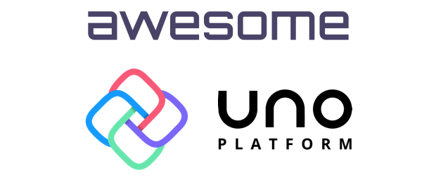

	

		
	

	 
	

List of **awesome resources** for developers using the Uno Platform for building cross-platform apps on Android, iOS, macOS, WebAssembly and Windows!

## Contents

- [General](#general)
- [Blogs](#blogs)
- [Libraries](#libraries)
  - [Toolkits](#toolkits)
  - [MVVM](#mvvm)
  - [Compatibility](#compatibility)
- [Live coding](#live-coding)
- [Open-source apps](#open-source-apps)
- [Libraries](#libraries)
- [Videos](#videos)

## General

- [Uno Platform official website](https://platform.uno)
- [Uno Platform Documentation home](https://platform.uno/docs/articles/intro.html)

## Videos

## Blogs
- [Official Uno Platform blog](https://platform.uno/blog/)
- [Martin Zikmund blog](https://blog.mzikmund.com/category/development/uno-platform/) - Uno Platform blog posts by Martin Zikmund
- [Nick's .NET Travels](https://nicksnettravels.builttoroam.com/tag/uno/) - Uno Platform blog posts by Nick Randolph
- [IObservable\<Opinion\>](https://ian.bebbs.co.uk/tags/uno-platform) - Uno Platform blog posts by Ian Bebbington

## Libraries

### Toolkits
- [Windows Community Toolkit for Uno](https://github.com/unoplatform/Uno.WindowsCommunityToolkit)
- [Telerik UI for Uno](https://github.com/unoplatform/Uno.Telerik.UI-For-UWP)

### MVVM
- [MVx.Observable](https://www.nuget.org/packages/MVx.Observable/) - A (mostly) unopinionated, light-weight alternative to ReactiveUI provided as a library _not a framework_.

### Compatibility
 - [SignalR](https://docs.microsoft.com/en-us/aspnet/signalr/overview/getting-started/introduction-to-signalr) - [Cross-Platform Real-Time Communication with Uno & SignalR](https://ian.bebbs.co.uk/posts/UnoChat)

## Live coding

## Open-source apps
- [UADO](https://github.com/unoplatform/uado) - Azure DevOps backlog viewer
- [Uno Calculator](https://github.com/unoplatform/calculator) - port of the Windows 10 Calculator
- [Uno Playground](https://github.com/unoplatform/Uno.Playground) - Uno Playground app with UI samples
- [Ch9](https://github.com/unoplatform/Uno.Ch9) - Channel 9 app
- [CO_duo_](https://github.com/ibebbs/CODuo) - Visualizing the environmental impact of current and forecast energy generation in the UK. Designed for use on both single and dual-screen devices.

## Presentations

## Videos

## Contribute

Contributions welcome! Read the [contribution guidelines](contributing.md) first.

## License

To the extent possible under law, Martin Zikmund has waived all copyright and
related or neighboring rights to this work.
